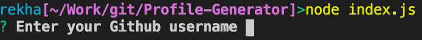

# Profile Generator

A Node applicaiton that generates a PDF profile based on GitHub content of a user.

#Process Flow
### Prompt user input 
  1. Get user GitHub Profile Name
  2. Color preference for their profile (PDF coloring option)
  3. Fetch data from GitHub and generate a PDF profile file

### Development Details 
#### This applicaiton uses Node JS packages
  - Axios - To pull content from GitHub (get API)
  - FS - To read/write files
  - Inquirer - To get user input (commandline prompts)
  - Puppeteer - To generate PDF file
  #  
  1. Inquirer prompts for user input to get GitHub profile name
      
      
  2. Using predefined color profile gives a choice to select a color for the PDF
  3. With these 2 information Axios get call pulls user GitHub content
  4. Using predefined styles and with the color choice from user HTML file is created with FS
      
  5. Using this HTML Puppeteer generates a PDF
      

### Screen grab
    

  
   
